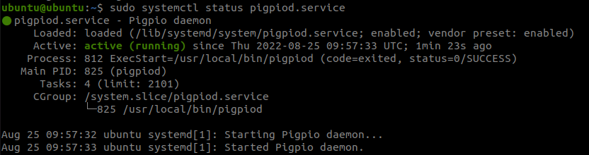

# Autostart services
This assumes that ds4drv and pigpio are installed on the raspberry pi running Ubuntu 20.04. 

## ds4drv
Responsible for pairing dualshock 4 controllers with the raspberry pi. I recommend using a USB bluetooth module. 

Copy the service file to systemd location and enable it for automatic startup 

*  ```
    sudo cp ds4drv.service /lib/systemd/system/
    ```
*  ```
    sudo systemctl daemon-reload
    ```
*  ```
    sudo systemctl enable ds4drv
    ```

## pigpio
To enable the GPIO interface on the raspberry pi. 

*  ```
    sudo cp pigpiod.service /lib/systemd/system/
    ```
*  ```
    sudo systemctl daemon-reload
    ```
*  ```
    sudo systemctl enable pigpiod
    ```

## Is it running?
Check the status of the service to know if it is running. 
*  ```
    sudo systemctl status pigpiod.service 
    ```
*  ```
    sudo systemctl status ds4drv.service 
    ```
    
